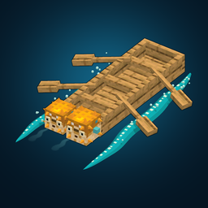

<p align="center">
  
</p>

# Longboat Lab · 长船实验室

**Minecraft Java 1.21.1 · Fabric · 模组版本 0.10.20**

把几艘船拼成一艘长船，再给它装上木铲、巨大桨和河豚。可以下水竞速，也可以靠巨大桨撑地越障，或者把船压缩起来，弹跳、发射钩爪。

Longboat Lab 直接改造原版船的合成、驾驶、碰撞和乘坐逻辑。普通世界里就能玩，仓库也附带一张约 4.66 公里的双人竞速地图。

[安装](#安装) · [开始改装](#开始改装) · [操作](#操作) · [竞速地图](#竞速地图) · [常见问题](#兼容性与常见问题) · [构建](#从源码构建) · [更新记录](CHANGELOG.md)

## 玩法

- **加长、加宽。** 同材质的船可以合成连续船体；多艘等长长船可以横向合并，增加座位。
- **用木铲划船。** 两侧桨越多，展开后的划行速度越快。左右不平衡会偏航，差距过大就会原地打转。
- **巨大桨越野。** 巨大桨有实际碰撞，能撑住地面、推动船身。桨越大，推力和越障能力越强。
- **河豚推进。** 船头、船尾、两侧和船底都能安装河豚。各面可以单独喷气，安装位置会影响推力和翻滚。
- **压缩、弹跳、钩爪。** 长船可以收成一节；压缩状态能弹跳，也能发射由船桨组成的刚性钩爪，抓住方块或实体。
- **水浪与驾驶视角。** 航行会留下侧浪、泡沫和尾迹，拍水会激起飞溅。另有可缩放 HUD、稳定后视和游戏内水面节点图。

## 安装

| 环境 | 要求 |
| --- | --- |
| Minecraft | Java 版 **1.21.1** |
| Java | **21 或更高**，建议使用 Java 21 |
| Fabric Loader | **0.16.0 或更高**；项目使用 0.19.3 |
| Fabric API | **必装**，选择适用于 1.21.1 的版本；项目使用 0.116.13+1.21.1 |
| 联机 | 客户端和服务端都要安装同版本模组及 Fabric API |

1. 准备 Minecraft 1.21.1 的 Fabric 游戏实例。
2. 将 `longboat-lab-0.10.20.jar` 和 Fabric API 放入该实例的 `mods` 文件夹。更新时移走旧版模组，不要安装 `-sources.jar`。
3. 启动游戏，进入普通世界或导入下方的竞速地图。

只有源码时，按[构建说明](#从源码构建)生成 JAR。Fabric API 不包含在本模组 JAR 中，需要单独安装。

**没有其他必装前置。** 模型、贴图、音效和水面 Shader 都已内置，不需要 Blockbench、GeckoLib、Cloth Config、Mod Menu 或外部光影包。运行依赖以 [fabric.mod.json](src/main/resources/fabric.mod.json) 为准。

## 开始改装

先准备两艘同材质的普通船、一些木铲、河豚桶和一把重锤。

1. **合成船体：** 两艘船放在不同合成格，得到两节长船。配方不限摆放形状。
2. **安装木铲：** 放下船，蹲下并用木铲右键船舷。一次装入当前手中的整叠，容量不足时留下余量。
3. **安装河豚：** 手持河豚桶瞄准船体，按预览位置蹲下右键安装。在船尾安装可向前推进；船底朝下安装可向上助推。
4. **下水：** 加长船默认压缩放置。上船后按 **R** 展开，用 **WASD** 划行，按住 **左 Alt** 喷气。
5. **拆除配件：** 持重锤蹲下右键瞄准的桨或河豚。非创造模式返还配件；创造模式不返还。

船体合成时，**等长且长度至少为 2 的船优先加宽**，其他情况下需宽度相同才能加长。下面的尺寸均为“长 × 宽”，输入船须同材质、无箱子。

| 合成示例 | 结果 |
| --- | --- |
| `1×1 + 1×1` | `2×1`，加长 |
| `4×1 + 1×1` | `5×1`，继续加长 |
| `4×1 + 4×1` | `4×2`，加宽 |

至少三件木铲或巨大桨分放在不同合成格，可以合成更大的桨。**巨大桨不能与普通桨混装，装上后船也不能压缩**；请先拆掉原来的普通桨，并留出展开空间。

容量、座位、合成保留规则和各项技能的详细说明见 [玩法手册](docs/gameplay.md)。

## 操作

新增按键可在 **选项 → 控制 → 按键绑定 → 长船实验室** 中修改。驾驶技能由驾驶员控制。

| 按键或交互 | 功能 |
| --- | --- |
| W / S、A / D | 前进 / 后退、转向 |
| 不蹲下，右键船舱 | 上船；乘坐时换到附近空座位 |
| R | 展开 / 压缩 |
| 空格 | 压缩船弹跳；钩爪已发射时优先松钩 / 收回 |
| G | 压缩状态发射或收回钩爪，空中也可发射 |
| 锁钩时 W / S | 收短 / 放长船桨链 |
| 锁钩时 ↑ ↓ ← → | 围绕锚点，沿当前链长对应的球面移动 |
| 按住左 Alt | 所有河豚一起喷气 |
| 小键盘 5 / 2 / 8 | 船底 / 船尾 / 船头单独喷气 |
| 小键盘 4 / 6 | 左舷 / 右舷单独喷气 |
| H / J | 开关 HUD / 切换 HUD 大小 |
| F7 | 开关乘船稳定后视 |
| 稳定后视下滚轮 | 拉近 / 拉远镜头 |
| Shift + F7 | 重新对齐镜头方向 |
| F8 | 打开水面节点图 |
| 蹲下 + 配件 / 重锤右键 | 安装 / 拆除配件 |

喷气方向键使用**独立数字小键盘**，不是键盘上排数字；没有小键盘可以重新绑定。喷气需要一直按住，松开后回充。

稳定后视跟随船的位置，但不跟随玩家转头或船体翻滚，适合高速自转时使用。按 F5 可切回原版视角。HUD 支持 75%、100%、125%、150% 四档大小，设置保存在 `config/longboatlab-hud.properties`。

## 竞速地图

随附地图为 **河豚盘山拉力赛 V12 · 自由练习**：约 **4.66 km** 的共用赛道，包含弹跳水闸、冰道、钩爪峡谷、U 弯近道、盘山水道、隧道和终点港池。

[地图压缩包](Puffer_Rally_Final.zip) · [存档目录](Puffer_Rally_Final/) · [游玩指南](Puffer_Rally_Final/README_游玩指南.md) · [路线总览](maps/Puffer_Rally_Mountain_V12_overview.png) · [关卡正交图](Stage_Orthographs_V12/)

### 导入

将 `Puffer_Rally_Final.zip` 解压到当前游戏实例的 `saves` 目录，确认路径为：

```text
saves/Puffer_Rally_Final/level.dat
```

不要多套一层文件夹，也不要把地图 ZIP 放进 `mods`。比赛数据包已包含在存档中。Gradle 开发客户端使用 `run/saves`。

独立服务器请在停服后复制存档，并在 `server.properties` 中设置 `level-name=Puffer_Rally_Final`。保留存档内数据包，`function-permission-level` 至少为 2。

### 竞速与自由练习

- **双人竞速：** 两名玩家站上出生港的青色、橙色平台。倒计时 10 秒后从岸上发船，自行下水。每人开局有一格船、2 个河豚桶、4 把木铲和重锤，快捷栏第一格留空。
- **计时单练：** 右键大厅发放的绿宝石。按顺序通过检查点，黄色箭头指主线，绿色箭头指近道。
- **自由练习：** 右键大厅发放的紫水晶碎片，或输入 `/trigger lr_free`。不计时，没有偏航提示和检查点要求，可以驾船探索全图，也可以多人一起练习。额外提供改装材料和两把 4 倍巨大桨。

四处补给港都可以直接驶入，水深一格。在船上靠近服务箱，空手右键领取；木船港旁边有工作台。

| 补给港 | 每人每局领取 |
| --- | --- |
| 绿色木铲港 | 木铲 ×6 |
| 蓝色木船港 | 船 ×2 |
| 两处黄色河豚港 | 每站河豚桶 ×4 |

每站只有一种物资，领取资格按玩家分别计算；背包装不下不会扣资格。自由练习中可重复领取。

比赛发放的指南针可保留改装救援，罚时 10 秒；追溯指针可换基础船，罚时 20 秒。羽毛退出，时钟在全员完赛后重开。自由练习返航不罚时。**开始或重置会整理参与者背包，重置还会清理旧船、掉落物和河豚。**

## 兼容性与常见问题

- **Sodium / Iris：** 检测到其中任一模组时，会关闭自定义水面位移，保留原版水面和浪花。它们不是本模组的前置。
- **其他船类模组：** 本模组修改原版船体、驾驶和乘员逻辑，同类修改可能冲突。其他渲染模组、资源包和“极佳”画质的组合尚未逐一验证。
- **水浪的作用：** 水面凹陷和波纹属于客户端视觉效果，不改变水方块，也不会把波浪作为真实流体力反馈给船。多船可以向同一局部水面叠加扰动；模拟范围和处理数量有固定预算，实际帧率取决于场景。
- **平台：** 仅面向 Java 版 1.21.1 Fabric，不提供 Forge、NeoForge 或基岩版版本。

<details>
<summary>常见问题与排查</summary>

**船没有动力，或者一直打转？**

检查左右桨数。全部拆空后无法划行，两侧数量不同会偏航；压缩状态每侧最多按一根普通桨计算动力。

**无法展开或安装巨大桨？**

先拆掉普通桨，再确认船体和巨大桨周围有足够空间。展开、放置及指令生成都会进行空间检查。

**上船或换座没有反应？**

不要蹲下，对准附近空座位所在的船舱。检查是否满员、正在变形或刚刚下船。乘船时瞄准可触及的箱子和工作台会优先使用方块。

**没有水面凹陷，或水面显示异常？**

先检查 Sodium / Iris，然后查看 `logs/latest.log` 中的 `LongboatLab/Water` 日志。也可添加 JVM 参数 `-Dlongboatlab.disableWaterSurface=true` 关闭位移效果。

**改装船加箱子后配置丢了？**

原版“船 + 箱子”配方不会复制改装数据。请直接改装箱子船，或用 `rig` 命令的 `Chest` 参数生成。

**长船物品超出物品栏格子？**

这是按船体实际比例显示的效果；长船不会自动缩到格子以内。

</details>

## 从源码构建

准备 **JDK 21**，在项目目录运行：

Windows：

```powershell
.\gradlew.bat build
```

Linux / macOS：

```sh
sh ./gradlew build
```

首次构建会下载 Gradle、Minecraft 和 Fabric 依赖。产物在 `build/libs/`，当前模组 JAR 为 `longboat-lab-0.10.20.jar`；`-sources.jar` 只包含源码。

工程可以独立构建，不依赖同级其他模组项目。已有资源随源码保存，普通编译不需要重新生成模型、贴图、音效或地图，也不需要 Python、Node.js 或 Blockbench。版本配置见 [gradle.properties](gradle.properties)，资源制作说明见 [开发文档](docs/development.md)。

## 文档与项目目录

| 文档 | 内容 |
| --- | --- |
| [玩法手册](docs/gameplay.md) | 船体合成、配件、座位、弹跳、钩爪和水面效果 |
| [命令参考](docs/commands.md) | 生成改装船、指定巨大桨尺寸、热调河豚喷气 |
| [地图指南](Puffer_Rally_Final/README_游玩指南.md) | 比赛、补给、救援与自由练习 |
| [开发与资源](docs/development.md) | Blockbench 源模型、资源工具和检查记录 |
| [更新记录](CHANGELOG.md) | 各版本改动 |

```text
src/main/                模组源码、模型、贴图、音效和 Shader
docs/                    玩法、命令和开发文档
tools/                   资源与地图生成、检查工具
maps/                    地图版本和路线预览
Puffer_Rally_Final/      随附地图存档
Puffer_Rally_Final.zip   地图分发包
Stage_Orthographs_V12/   各关卡的离线正交渲染图
```

关卡正交图由存档方块离线渲染，不是游戏截图，不包含游戏内 Shader、粒子和动画。

## 问题反馈

提交 Issue 时，请附上模组版本、Fabric Loader / API 版本、其他相关模组、复现步骤，以及 `logs/latest.log` 中的报错；崩溃时附上对应的 `crash-reports` 文件。

驾驶或碰撞问题请说明船的长宽、左右桨数量与尺寸、河豚安装位置，以及是否在多人游戏中发生。画面问题附截图或短视频更容易定位。

仓库中的离线检查记录覆盖部分语法、数据和数值逻辑，不代表游戏内画面、性能或多人兼容性已经全部验证。

## 许可与素材

模组元数据声明使用 **MIT** 许可。Minecraft 原版衍生贴图仍归其原权利人所有，不能按项目源码许可重新授权。模型、音效和贴图的来源见[开发与资源说明](docs/development.md)。
